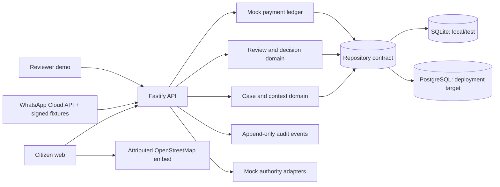

# Challan Nyay

> Understand the evidence, choose the right action, and track a traffic-challan dispute from notice to reasoned resolution.

Challan Nyay is an independent, nationwide-by-design public-service prototype built for **Build What Moves India**. It combines a calm citizen experience with a real API-backed complaint, review, decision and payment-demonstration loop.

It uses only synthetic identities, vehicles, challans, evidence and payments. It is not affiliated with or endorsed by any government authority.

**Public deployment:** [https://challan-nyay.vercel.app/](https://challan-nyay.vercel.app/) — backed by the managed PostgreSQL adapter and visibly labelled as a synthetic independent prototype.


## The problem

Indian citizens can receive traffic challans through camera systems, local enforcement and multiple jurisdiction-specific platforms. Finding the notice is only the beginning. Citizens may still need to understand the evidence, identify a wrong vehicle, choose a valid grievance ground, follow the correct authority and discover what happened after submission.

The official March 2026 Rajya Sabha answer reports **39,349,727 camera and manual challans** and **307,150 complaints** during 2025. Challan Nyay focuses on the high-friction resolution journey behind those complaints.

## What makes this different

This is not a cosmetic portal clone or another payment aggregator. The product proof is a connected citizen-to-reviewer resolution loop:

1. Find a synthetic challan using a vehicle number, challan number or driving licence.
2. Review the allegation, amount, deadline, original evidence, plate crop and attributed map location.
3. Compare the detected vehicle with the authorized vehicle profile.
4. Submit a guided grievance with a structured reason and evidence statement.
5. Receive a durable receipt and track the current owner and review target.
6. Let a human reviewer inspect the same evidence and record a reasoned decision.
7. Return to the citizen view and see the decision, timeline and next action.

Every consequential write is idempotent and creates an audit event. No AI system decides guilt, accepts a payment, quashes a challan or rejects a grievance.

## Demo path

The public entry is usable as a guest. A synthetic account is optional for people who manage several vehicles.

### Flagship guest journey

| Field | Demo value |
|---|---|
| Vehicle number | `UP16NX2041` |
| Challan number | `CN-GUEST-CHALLAN` |
| Driving licence | `DL-GUEST-2026` |
| Human check | Answer the visible arithmetic prompt |

Open the wrong-vehicle case, inspect the fixed-camera evidence and map, raise a grievance, enter the reviewer demo, issue a reasoned decision and return to the citizen timeline.

### Optional account journey

Choose **Create demo account**, keep the prefilled synthetic mobile identifier, select **Send demo OTP**, and enter `246810`.

- **Amit Rao:** three vehicles and ten challans across action-required, paid, under-review, quashed and rejected states.
- **Neha Logistics:** two vehicles and six challans demonstrating a small fleet account.
- **Farah Nair:** one vehicle and four challans including open, review and closed outcomes.

The selected account, page, language, text size and contrast preference persist locally between page changes and reloads.

## Architecture

The hackathon build is a modular monolith with explicit adapter boundaries. The browser journey is real; government, identity, payment and notification systems are mocked.



Important architecture choices:

- vehicle-first guest lookup plus an optional account layer;
- jurisdiction and rule versions carried with every normalized case;
- fixed-camera and officer-mobile evidence normalized into one envelope;
- immutable original-evidence intent with derived plate-crop lineage;
- separate payment-provider and challan-ledger states;
- optimistic version checks and idempotency keys for consequential writes;
- AI assistance kept optional and outside every legal or payment decision.

## Implementation status

| Capability | Status | Notes |
|---|---|---|
| Protected guest lookup | Implemented | Server-issued expiring arithmetic check and documented synthetic identifiers |
| Multi-account and multi-vehicle experience | Implemented | Three profiles, six vehicles and twenty account-linked challans, plus three distinct guest lookup cases |
| Evidence, plate and event location | Deployed | Shared evidence passport with capture source, immutable-original/hash, crop lineage, registry comparison and attributed OpenStreetMap context |
| Guided grievance and receipt | Deployed | Six server-owned issue contracts, versioned draft recovery, bounded evidence requests and contract-safe reasoned outcomes |
| Authority operations foundation | Deployed synthetic workspace | Aggregate queue summary, compact paginated worklist, bounded reviewer batches, lease-based claim and human reasoned decision |
| Event-backed citizen tracking | Deployed | Account progress and case timelines are projected from persisted, versioned workflow events shared with authority actions |
| Mobile, contrast and low-data access | Deployed | Compact 320/390 px controls, preserved native scrolling, optimized WebP media and explicit evidence/map loading |
| Payment demonstration | Deployed mock | One/few/all selection, explicit mock UPI-app choice, atomic posting and downloadable synthetic receipts; no card, UPI ID, bank account, password or real OTP is collected |
| SQLite/PostgreSQL repository boundary | Deployed | SQLite remains the local/test adapter; the public Vercel build selects the managed PostgreSQL adapter |
| Government, VAHAN and state-RTA connections | Mocked boundary | No undocumented or live government API is called |
| English, Hindi and Telugu | Entry-flow pilot | Case and reviewer content still needs reviewed full-flow localization |
| Real identity, uploads and payments | Planned | Requires authorized providers, contracts and production security controls |
| WhatsApp citizen channel | Live developer pilot + automated contract proof | The public Meta callback answers live inbound `Hi` with English/Hindi selection. Deterministic tests cover protected lookup, same-store case/media/location views, tracking, grievance guidance, receipts, and one/few/all payment handoffs with mock UPI-app selection. A production WhatsApp number, native WhatsApp payment and unrestricted recipients are not claimed |

## Technology

- **Web:** React 19, Vite 6 and native responsive CSS
- **Icons:** Phosphor Icons
- **API:** Fastify 5
- **Persistence:** Node.js built-in SQLite for local/test use; `pg` and versioned PostgreSQL migrations for the deployment target
- **Maps:** attributed OpenStreetMap embed and external fallback link
- **Performance:** optimized WebP renditions and a persistent low-data mode that defers large media and map embeds
- **Hosting package:** static client plus the included Sites worker handoff

## Run locally

Requirements: Node.js 22 or newer and npm.

From the repository root, start the API:

```powershell
cd apps/api
npm install
npm run dev
```

Start the web application in a second terminal:

```powershell
cd apps/web
npm install
npm run dev -- --host 127.0.0.1 --port 4173 --strictPort
```

Open `http://127.0.0.1:4173/`.

To exercise the PostgreSQL adapter, set `CHALLAN_NYAY_DATABASE_URL` and run `npm run db:migrate` from the repository root. Do not use the deployment target without also configuring unique challenge and session secrets from `.env.example`.

Direct synthetic QA views are available at `/?demo=dashboard`, `/?demo=challans`, `/?demo=case`, `/?demo=services` and `/?demo=reviewer`.

## Verify the build

```powershell
cd apps/api
npm test

cd ../web
npm run test:sites
npm run build
```

Current locally verified baseline:

- API tests: **49 passed, 1 skipped** (the skipped test requires `CHALLAN_NYAY_TEST_DATABASE_URL` pointing to a separate PostgreSQL integration target)
- static-hosting tests: **4/4 passed**
- real-browser Playwright journeys: **12/12 passed** (citizen-to-authority decision/reset loop, browser Back/Forward routing, mobile low-data/high contrast, all three guest lookup routes, guest return-context integrity, distinct authority entry and direct route, authority evidence sizing, multi-profile persistence, serious/critical axe checks, WhatsApp-to-web grievance continuity, atomic pay-all continuity, and selected-challan payment continuity)
- production web build: **passed**
- SQLite atomic mutation, idempotency, stale-version, versioned draft recovery, issue-safe reviewer outcomes, file-backed restart isolation, concurrent-decision conflict and persisted channel replay: **passed**
- live PostgreSQL startup and public citizen/account/browser checks: **passed**; a deliberate multi-region/cross-instance stress exercise remains outside this submission gate

These checks do not claim formal WCAG 2.2 AA certification. Full assistive-technology coverage, complete automated-rule coverage, slow-network and deployed HTTPS checks remain release acceptance work.

Run the complete local gate with `npm run verify`. It writes a machine-readable, explicitly local-only report to `output/release-evidence/phase8-release-audit.json`.

## Accessibility and public-service safeguards

- keyboard-visible focus and skip navigation;
- semantic landmarks, headings and labelled controls;
- persistent text-size and high-contrast controls;
- reduced-motion support and narrow-screen reflow;
- plain-language case owner, deadline and next-action guidance;
- scam warning and explicit mock-payment disclosure;
- no Aadhaar, PAN, real registration, real driving licence, real OTP or payment credentials;
- no government emblem, seal, programme logo or endorsement claim.

## Repository guide

- [`AGENTS.md`](AGENTS.md): non-negotiable implementation and safety rules
- [`RULES.md`](RULES.md): competition and public-positioning constraints
- [`PRODUCT_BRIEF.md`](PRODUCT_BRIEF.md): product definition and scope
- [`RESEARCH/`](RESEARCH/): official sources, citizen pain and benchmark research
- [`DESIGN/`](DESIGN/): flows, design direction, accessibility and audit evidence
- [`ARCHITECTURE/`](ARCHITECTURE/): domain, evidence, security and integration boundaries
- [`DELIVERY/`](DELIVERY/): scope, acceptance criteria, tests and submission material
- [`GOVERNANCE/`](GOVERNANCE/): decisions, content, data, licensing and third-party notices
- [`apps/web/`](apps/web/): citizen and reviewer React application
- [`apps/api/`](apps/api/): Fastify API, SQLite/PostgreSQL repositories, migrations and domain/contract tests

## Sources

- [Build What Moves India brief](https://buildwhatmovesindia.com/brief)
- [Build What Moves India FAQ](https://buildwhatmovesindia.com/faq)
- [Rajya Sabha answer on e-challan grievance redressal, 25 March 2026](https://sansad.in/getFile/annex/270/AU3764_TntZ75.pdf?source=pqars)
- [Central Motor Vehicles (Third Amendment) Rules, 2026](https://egazette.gov.in/WriteReadData/2026/269493.pdf)
- [Parivahan eChallan](https://echallan.parivahan.gov.in/)
- [NextGen eChallan](https://echallan.parivahan.nic.in/challan/challan-services)

## Licence and disclosure

No open-source licence has been granted yet. The source and original project assets remain all rights reserved unless a root licence is added later. Third-party libraries and services remain under their respective terms and are recorded in [`GOVERNANCE/THIRD_PARTY_NOTICES.md`](GOVERNANCE/THIRD_PARTY_NOTICES.md).

Built with OpenAI Codex. Government, court, identity, payment and notification integrations are mocked. All displayed people, identifiers, documents, vehicles, cases, evidence and financial records are synthetic.
